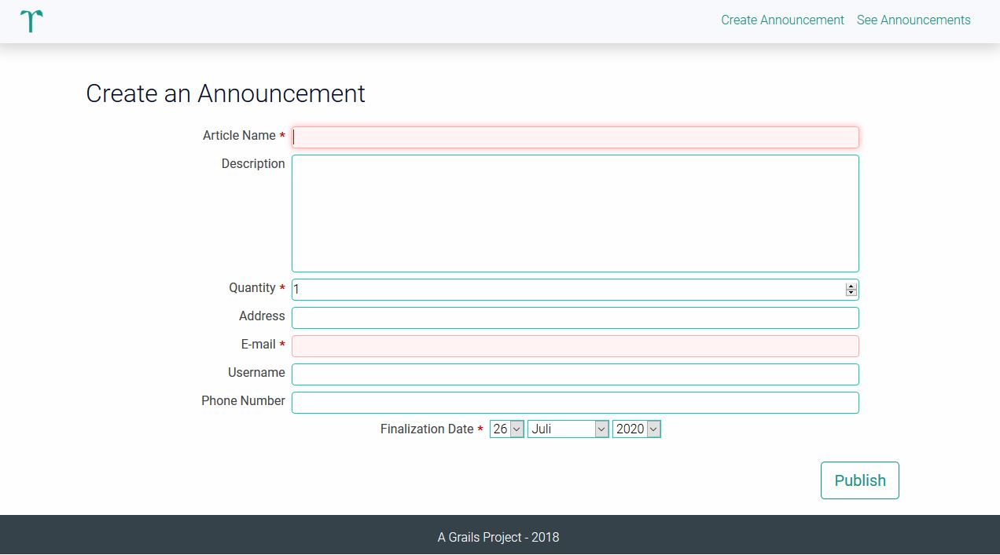
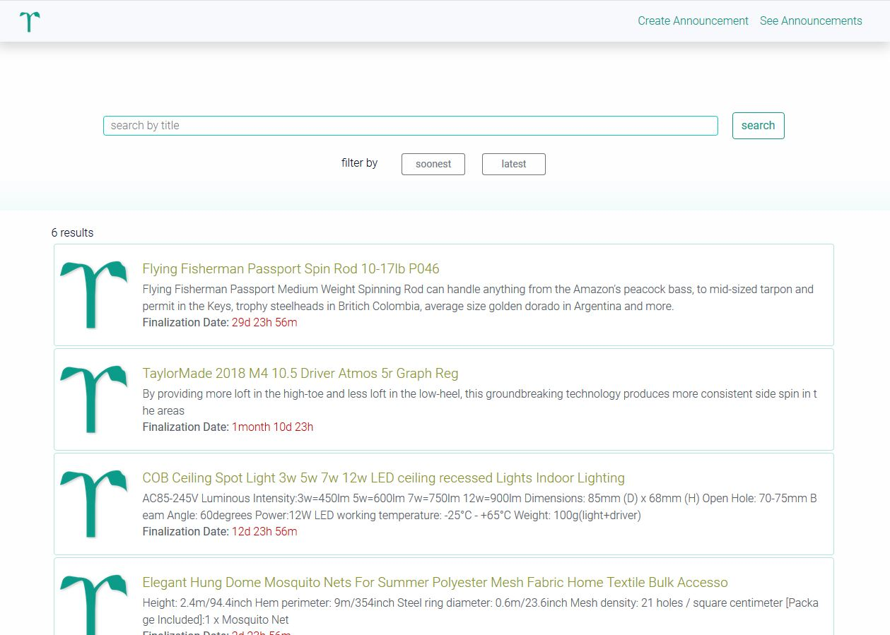
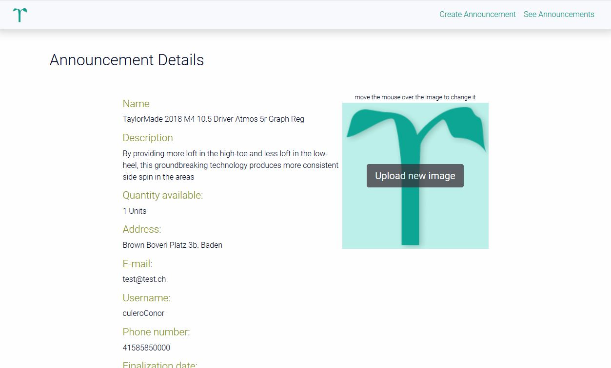
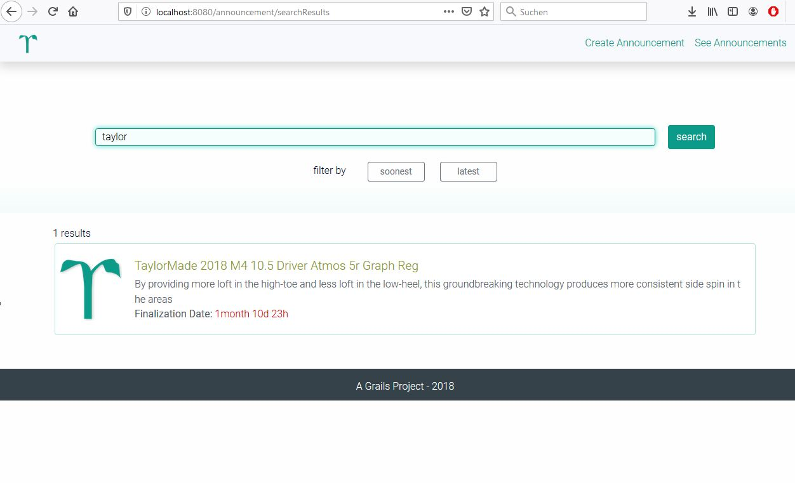
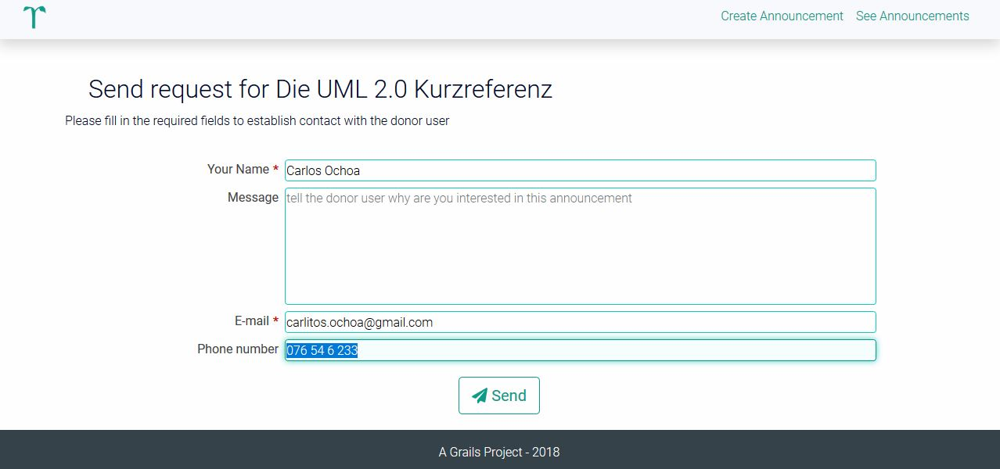
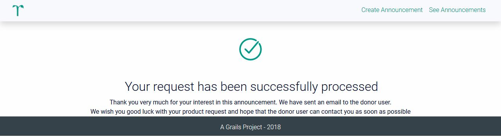

### Grails Example
This is a basic grails project example about a web application to donate and get second-hand articles

### Motto
Don't you wanna use it anymore? Do not throw it away, give it away.

### Reasons:
Every year tons of reusable products are thrown away and they can be given a second chance.

### Use cases and Application screenshots:

#### MVP
- **As a** `donor user`, **I would like to** create an announcement **so that** I can let others know that i have an article to donate

- **As an** `interested user` **I would like to** see a list of articles offered by donate users **so that** i can pick articles i am interested in

- **As an**  `interested user` **I would like to** see the details of the article in which I am interested with contact details

#### Extra Functionalities:

- **As an**  `interested user` **I would like** to filter the list by keyword **so that** i can easily find articles that match my desires

- **As an**  `interested user` **I would like** to send notifications (messages) to the bidding user in such a way **that** I can indicate that I am interested in the article.

- **As a** `donor user` **I would like to** receive notifications (messages) from interested users indicating their interest in my article **so that** i can manage my donation easily

## Project details

### How to start the project: 
#### Initializing Reyours - Grails App
To initialize the application, just use the grails run-app command
#### Accessing to scripts for the mail notification service
For the Mail notification service, two things must be taken into account:

1. The script 'form-submission-handler.js' which is located in the directory './assets/javascripts'
2. The javascript code of the previous file is called once the user submits the form of the view 'sendEmail.gsp' which is located in the path './views/announcement'. This in turn sends an http post request with the data form type dictionary to the google script located at the following web address. To access it it is necessary to use the following email and password:

#### Email access information (works so long nobody steals it :))
**email:** reyours.team@gmail.com\
**Password:** reyours1234

The link to google script is [here](https://script.google.com/macros/d/M0yehYLiYxNsCMmSAMyuqSj015RkZUNyx/edit?uiv=2&mid=ACjPJvG65Admm-ixdATFwxYgXG7eHXnrLBAhb2sWmWL_PDVOgMkoxACJMSHghelsjZgn3fuh1az1nAUDU3x8TyX69by8WzYqQOfw7Z87QxrUtQkFsGJ3fNgTtvWFk8_A3IDUfD1fbk-xnG4)

In case the previous link does not work you can access the google document that contains it following [this link](https://docs.google.com/spreadsheets/d/1JqnfvuJiKduem6fO5F7B5WAMvmug16zPc_5HMM_WEPk/edit#gid=0) then select the option 'tools/script editor'

### Hand-written, static HTML 
#### project description:
a small introduction of the project and its features can be found on the root directory under the name 'index.html'

## External contributions:
- The Grails tutorials and the code examples provided in the official Grails documentation as well as in the
  [sdelamo Github Repository](https://github.com/grails-guides/grails-upload-file/commits?author=sdelamo) were of enormous help
- I have used and modified the necessary code for the mail notification service. The Github repository is accessible from this [link](https://gist.github.com/CodeMath/eb26878afba9e3b269cab9b4e91618bf)
